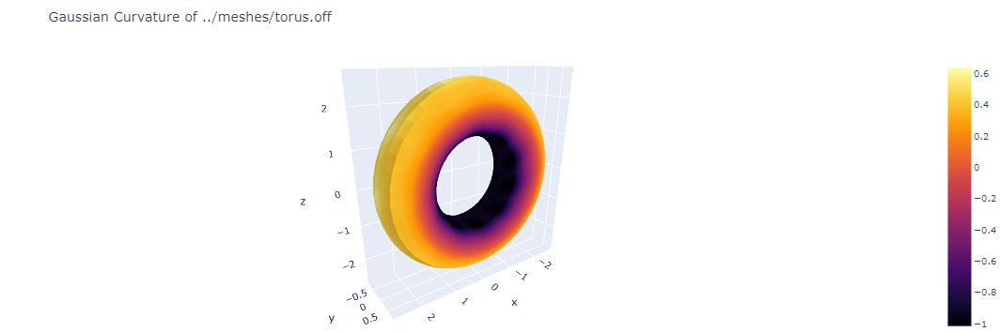
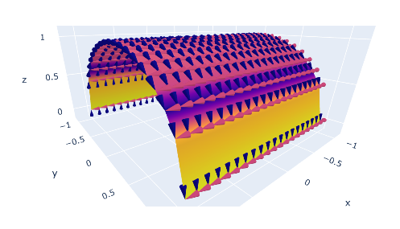

# Surface Curvature in Python

Several implementations of calculating mean, gaussian, and normal surface curvature along with principal curvature and respective directions.

The functions allow the surface to be defined either symbolically (with sympy) or discretely.
You can of course take a discrete surface and fit a polynomial to the data to create a symbolic expression of the surface. Or vice-vera, by taking a symbolic function and picking out a set of data points along the surface to use for discrete evaluation.

The data can be either explicit `z = f(x,y)` or parametric `(u,v) --> < x(uv), y(u,v), z(u,v) >`
There is yet another way to define a surface, implicitly `F(x,y,z) = 0`, but I have not created the functions for it yet.

These are most likely not the fastest or optimized ways to do the calculations, instead, they are meant to be a medium to learn differential geometry and how the formulas are implemented into computer code.





- [x] Symbolic
  - [x] Explicit
    - [x] Mean
    - [x] Gaussian
    - [x] Principal
    - [x] Principal vectors
  - [x] Parametric
    - [x] Mean
    - [x] Gaussian
    - [x] Principal
    - [x] Principal vectors
- [x] Discrete (orthogonal)
  - [x] Explicit (monge patch)
    - [x] Mean
    - [x] Gaussian
    - [ ] Principal
    - [ ] Principal vectors
  - [x] Parametric
    - [x] Mean
    - [x] Gaussian
    - [x] Principal
    - [x] Principal vectors
  - [ ] Arbitrary Mesh
    - [ ] [Discrete Differential-Geometry Operators for Triangulated 2-Manifolds. Mark Meyer, Mathieu Desbrun, Peter Schröder and Alan H. Barr. VisMath 2002](http://www.multires.caltech.edu/pubs/diffGeoOps.pdf)
      - see `example/DiffGeoOps.ipynb`
    - [ ] [Rusinkiewicz, Szymon. "Estimating Curvatures and Their Derivatives on Triangle Meshes," Proc. 3DPVT, 2004.](https://gfx.cs.princeton.edu/pubs/Rusinkiewicz_2004_ECA/curvpaper.pdf)
    - [ ] [Using a localized fitting of surface to each vertex normal for computing curvature. polynomial regression or quadratic interpolation on the nearby vertices around the point to calculate curvature.](https://stackoverflow.com/a/14234542)

## References:

### Definitions

- https://en.wikipedia.org/wiki/Differential_geometry_of_surfaces
- https://en.wikipedia.org/wiki/Curvature
- https://en.wikipedia.org/wiki/Principal_curvature
- https://en.wikipedia.org/wiki/Mean_curvature
- https://en.wikipedia.org/wiki/Gaussian_curvature
- https://en.wikipedia.org/wiki/Parametric_surface#Curvature

https://mathworld.wolfram.com/MeanCurvature.html

http://wordpress.discretization.de/geometryprocessingandapplicationsws19/a-quick-and-dirty-introduction-to-the-curvature-of-surfaces/

https://liavas.net/courses/math430/files/Surfaces.pdf

https://jhavaldar.github.io/assets/2017-07-16-diffgeo-notes5.pdf

https://github.com/sujithTSR/surface-curvature/blob/master/surface.py

https://www.mathworks.com/matlabcentral/fileexchange/11168-surface-curvature

### Discrete Algorithms:

- 2004 Caltech Paper over Discrete Surface Curvature approach
  - https://thesis.library.caltech.edu/2186/1/phd.pdf
  - http://www.multires.caltech.edu/pubs/diffGeoOps.pdf
  - https://github.com/justachetan/DiffGeoOps/blob/master/DiffGeoOps.py
- 2004 Princeton Paper for "Estimating Curvatures and Their Derivatives on Triangle Meshes"

  - https://gfx.cs.princeton.edu/pubs/Rusinkiewicz_2004_ECA/curvpaper.pdf
  - https://stackoverflow.com/questions/14234127/how-to-get-principal-curvature-of-a-given-mesh
  - https://github.com/Forceflow/trimesh2/blob/main/libsrc/TriMesh_curvature.cc

- https://libigl.github.io/libigl-python-bindings/tut-chapter1/
  - https://github.com/alecjacobson/geometry-processing-curvature
  - https://github.com/libigl/libigl/blob/0a92f2cdb26b2b557566f80bc07f8d4254879fbd/include/igl/principal_curvature.cpp
- https://github.com/cuge1995/curvature-calculation-python/blob/main/plcurvature.py
- https://blender.stackexchange.com/questions/146819/is-there-a-way-to-calculate-mean-curvature-of-a-triangular-mesh/147371#147371

`Curvedness = sqrt((k1**2 + k2**2)/2)`

- https://www.researchgate.net/publication/324908170_Description_and_Retrieval_of_Geometric_Patterns_on_Surface_Meshes_using_an_edge-based_LBP_approach

https://machinelearningmastery.com/a-gentle-introduction-to-the-laplacian/

```
python -m unittest discover .\tests\
```
